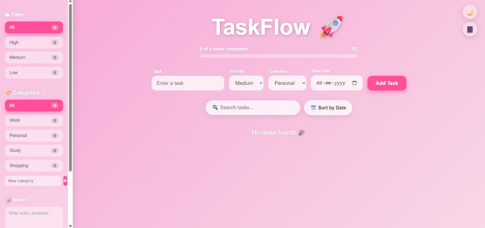

# TaskFlow 🚀

A modern, feature-rich task management app built with React and deployed on Vercel.

🔗 **Live Demo:** [dotaskflow.vercel.app](https://dotaskflow.vercel.app)

---

## Features

- **Add, Edit, Delete Tasks** — Full task management
- **Priority Levels** — High, Medium, Low with color coding
- **Categories** — Work, Personal, Study, Shopping + custom categories
- **Due Dates** — Set deadlines with overdue indicators
- **Due Today Alert** — Visual badge for tasks due today
- **Search** — Find tasks instantly
- **Filter by Priority** — View tasks by urgency
- **Sort by Date** — Earliest deadline first
- **Progress Bar** — Track completion percentage
- **Completed Section** — Separate section for done tasks
- **Clear All Completed** — One click cleanup
- **Notes** — Sidebar notepad for quick notes & timetable
- **Diary** — Daily journal with date stamp
- **10 Color Themes** — Pink, Purple, Blue, Green, Orange, Red, Teal, Yellow, Indigo, Rose
- **Dark Mode** — Easy on the eyes
- **Local Storage** — Tasks persist after refresh
- **Fully Responsive** — Works on mobile and desktop

---

## 🛠️ Tech Stack

- **React** — Frontend framework
- **CSS** — Custom styling with glassmorphism design
- **Vite** — Build tool
- **Vercel** — Deployment
- **localStorage** — Data persistence

---

## Getting Started

```bash
# Clone the repo
git clone https://github.com/yourusername/TaskFlow.git

# Install dependencies
cd TaskFlow
npm install

# Run locally
npm run dev
```

---

## Screenshots



---

## Made by Harshita Singh
